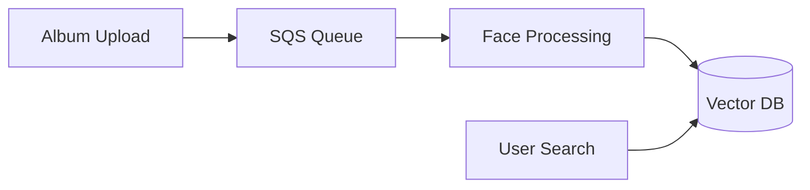

# Face Recognition Service

## Architecture Overview

### 1. Processing Strategy
- **Primary Processing**: On-demand instances for reliability
- **Fallback Processing**: Spot instances for overflow/backlog only
- **No Risk of Interruption**: Complete album processing guaranteed

### 2. Infrastructure
```yaml
Primary Processing (Album Indexing):
  Instance: c6i.2xlarge (On-demand)
  Specs:
    - 8 vCPUs
    - 16GB RAM
    - ~20 images/second
  Scaling:
    Min: 1
    Max: 3
    Trigger: SQS queue length > 1000 images
  Processing Time:
    - 5000 image album ≈ 4-5 minutes
    - 10000 image album ≈ 8-10 minutes

Search Service:
  Instance: Same primary instance
  Performance:
    - Search time: < 500ms
    - Concurrent searches: 50+
```

### 3. Cost Analysis
```plaintext
Monthly Estimate:
- Primary Instance (c6i.2xlarge): ~$250/month
- Additional instances during peaks: ~$100/month
- Database & Storage: ~$100/month
- Network & Others: ~$50/month

Total: ~$500/month

Current Rekognition Cost: $676.53/month
Potential Savings: ~25%
```

### 4. Key Benefits
1. **Reliability First**
   - Guaranteed processing completion
   - No interruption risks
   - Consistent performance

2. **Business Aligned**
   - Fast processing for new uploads
   - Always available search
   - Supports peak sales periods

3. **Cost Effective**
   - Still cheaper than Rekognition
   - Predictable pricing
   - No per-request costs

### 5. Processing Flow


### 6. Monitoring & SLAs
- Processing Start: < 30 seconds after upload
- Album Processing: < 10 minutes for 10k images
- Search Response: < 500ms
- System Uptime: 99.9%

## Features

- **AWS Rekognition Compatible API**
  - Face detection and analysis
  - Face indexing and search
  - Collection-based organization
  - Similar request/response formats

- **Key Benefits**
  - Self-hosted and private
  - Cost-effective (fixed infrastructure cost)
  - Customizable thresholds and settings
  - High performance (50ms per face)
  - Production-ready accuracy (99.77% on LFW)

## Quick Start

```bash
# Clone repository
git clone https://github.com/yourusername/facerec.git
cd facerec

# Install dependencies
poetry install

# Set environment variables
cp .env.example .env
# Edit .env with your settings

# Setup database
createdb facerec  # Create PostgreSQL database
alembic upgrade head  # Apply database migrations

# Run service
poetry run uvicorn app.main:app --reload
```

## Database Management

The service uses PostgreSQL for metadata storage and Pinecone for vector search.

### Database Setup
```bash
# Create database
createdb facerec

# Apply migrations
alembic upgrade head

# Create new migration after model changes
alembic revision --autogenerate -m "Description of changes"

# Rollback last migration
alembic downgrade -1

# View migration history
alembic history
```

## API Usage

### 1. Detect Faces
```http
POST /api/v1/detect-faces
Content-Type: multipart/form-data

file: <image_file>
```

### 2. Index Faces
```http
POST /api/v1/collections/{collection_id}/index-faces
Content-Type: multipart/form-data

file: <image_file>
external_image_id: "optional_reference"
```

### 3. Search Faces
```http
POST /api/v1/collections/{collection_id}/search-faces
Content-Type: multipart/form-data

file: <image_file>
similarity_threshold: 80.0
max_faces: 10
```

## Configuration

Key settings in `.env`:
```bash
# Core Settings
ENVIRONMENT=development
MAX_IMAGE_PIXELS=1920x1080

# Face Recognition
MAX_FACES_PER_IMAGE=20
MIN_FACE_CONFIDENCE=0.9
SIMILARITY_THRESHOLD=0.8

# PostgreSQL Settings
POSTGRES_HOST=localhost
POSTGRES_PORT=5432
POSTGRES_USER=postgres
POSTGRES_PASSWORD=your_secure_password
POSTGRES_DB=facerec

# Vector Store (Pinecone)
PINECONE_API_KEY=your_key
PINECONE_ENVIRONMENT=gcp-starter
PINECONE_INDEX_NAME=face-recognition
```

## Performance

- **Response Times**
  - Face detection: ~100ms
  - Face search: ~200ms
  - Batch processing available

- **Resource Usage**
  - Memory: 1-2GB base
  - Storage: Based on collection size
  - CPU: Single core per request

## Development

### Database Migrations
When making changes to database models:
1. Update models in `app/infrastructure/database/models.py`
2. Generate migration: `alembic revision --autogenerate -m "Description"`
3. Review generated migration in `migrations/versions/`
4. Apply migration: `alembic upgrade head`

## Deployment

Docker:
```bash
docker build -t facerec .
docker run -p 8000:8000 facerec
```

Kubernetes:
```bash
kubectl apply -f k8s/
```

## License

MIT License - See LICENSE file 