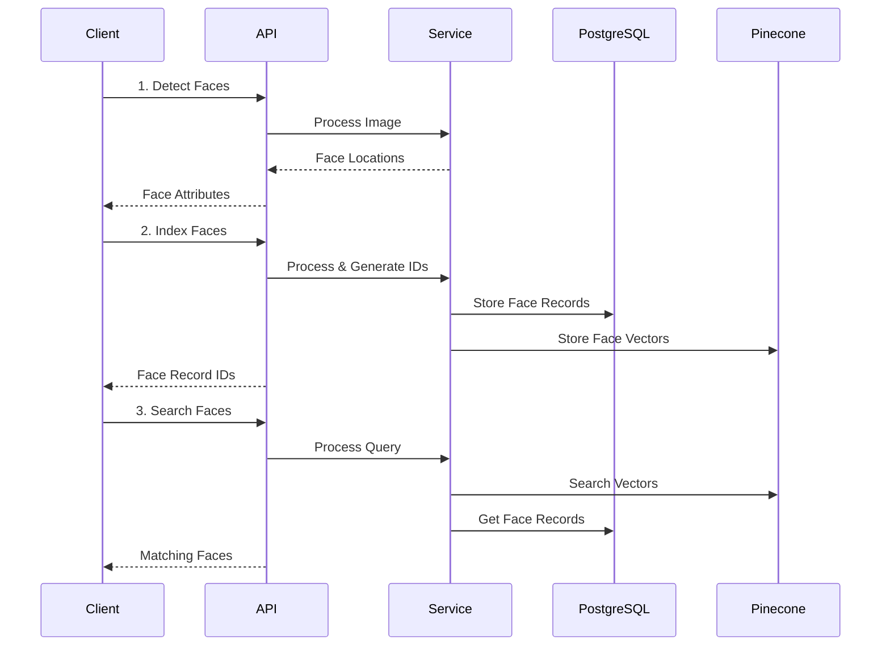

# Architecture Overview

## Core Components

### 1. API Layer (FastAPI)
- Request handling and validation
- File upload processing
- Error handling and logging
- Response formatting

### 2. Service Layer
- Face detection and analysis (InsightFace)
- Vector operations
- Business logic
- Resource management

### 3. Storage Layer
- PostgreSQL for metadata
- Pinecone for vector search
- Clear separation of concerns

## Data Model

### PostgreSQL Schema
```sql
Collections
  - id: UUID (primary key)
  - name: string
  - created_at: timestamp
  - metadata: jsonb (optional)

FaceRecords
  - id: UUID (primary key)
  - collection_id: UUID (foreign key)
  - external_image_id: string (optional)
  - confidence: float
  - bounding_box: jsonb
  - quality_score: float
  - created_at: timestamp
  - metadata: jsonb
```

### Vector Storage (Pinecone)
```python
# Metadata stored with vectors
{
    "face_id": str,          # Internal face record ID
    "collection_id": str,    # Internal collection ID
    "external_image_id": str # Optional client reference
}
```

## Service Flow



## Scalability

1. **Database Scalability**
   - PostgreSQL horizontal scaling with read replicas
   - Pinecone automatic vector scaling
   - Independent scaling of metadata and vectors

2. **API Scalability**
   - Stateless API servers
   - Horizontal scaling
   - Load balancing ready

3. **Processing Scalability**
   - Face detection parallelization
   - Batch processing for large collections
   - Async operations with queues

## Error Handling

1. **Input Validation**
   - Image format and size
   - Request parameters
   - Business rules

2. **Service Errors**
   - Model loading/inference
   - Resource limits
   - Async operation failures

3. **Storage Errors**
   - Database connectivity
   - Vector store operations
   - Data consistency

## Monitoring

1. **Performance Metrics**
   - Response times
   - Memory usage
   - Model performance
   - Error rates

2. **Resource Usage**
   - Database connections
   - Vector store capacity
   - API instance health

3. **Business Metrics**
   - Requests per collection
   - Face detection quality
   - Search accuracy

## Security

1. **API Security**
   - Authentication/Authorization
   - Rate limiting
   - Input sanitization

2. **Data Security**
   - Encryption at rest
   - Secure connections
   - Access control

3. **Infrastructure Security**
   - Network isolation
   - Resource limits
   - Audit logging 