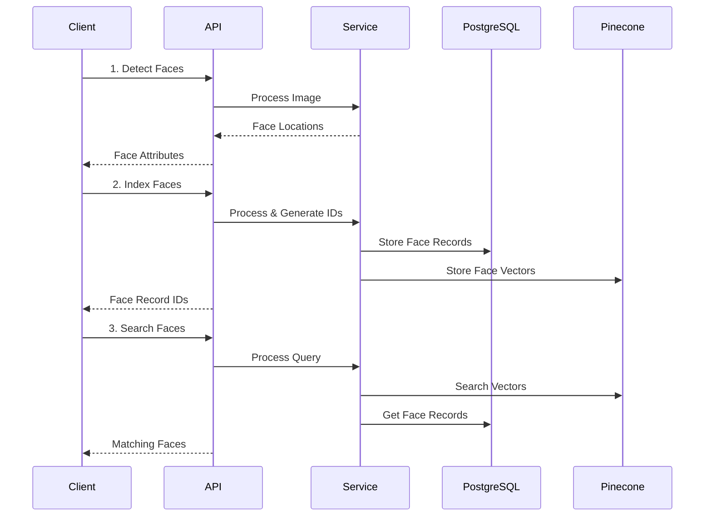

# Architectural Decisions

## Database Architecture

### Why We Need Our Own Database

1. **Better Control and Consistency**
   - Manage face IDs and metadata internally
   - Ensure consistency between PostgreSQL metadata and Pinecone vectors
   - Track face quality metrics and additional metadata
   - Handle collection lifecycle management

2. **Simplified Integration**
   - Clients only need to store our face IDs
   - No need to manage their own face detection records
   - Similar to AWS Rekognition's approach
   - Clear separation of concerns

3. **Data Model**
```sql
-- Core entities
Collections
  - id: UUID (primary key)
  - name: string
  - created_at: timestamp
  - metadata: jsonb (optional)

FaceRecords
  - id: UUID (primary key)
  - collection_id: UUID (foreign key)
  - external_image_id: string (optional)
  - confidence: float
  - bounding_box: jsonb
  - quality_score: float
  - created_at: timestamp
  - metadata: jsonb
```

### Vector Storage (Pinecone)

```python
# Metadata stored with vectors
{
    "face_id": str,          # Our internal face record ID
    "collection_id": str,    # Our internal collection ID
    "external_image_id": str # Optional client reference
}
```

## Service Architecture

### Components
1. **API Layer** (FastAPI)
   - Handles HTTP requests
   - Input validation
   - Rate limiting
   - Authentication/Authorization

2. **Service Layer**
   - Face detection and analysis
   - Vector operations
   - Business logic

3. **Storage Layer**
   - PostgreSQL for metadata
   - Pinecone for vector search
   - Clear separation between vector and metadata operations

### API Flow

1. **Detect Faces**
```http
POST /detect-faces
Request:
  - image: bytes
Response:
  - faces: List[Face]  # Locations and attributes only
```

2. **Index Faces**
```http
POST /collections/{collection_id}/index-faces
Request:
  - image: bytes
  - external_image_id: str (optional)
Response:
  - face_records: List[FaceRecord]  # Our generated face IDs
```

3. **Search Faces**
```http
POST /collections/{collection_id}/search-faces
Request:
  - image: bytes
  - max_results: int = 10
  - similarity_threshold: float = 80.0
Response:
  - matches: List[FaceMatch]  # With our face IDs
```

## Workflow



## Scalability Considerations

1. **Database Scalability**
   - PostgreSQL can be scaled horizontally with read replicas
   - Pinecone handles vector scaling automatically
   - Metadata and vector storage can scale independently

2. **API Scalability**
   - Stateless API servers
   - Can be scaled horizontally
   - Load balancing ready

3. **Processing Scalability**
   - Face detection can be parallelized
   - Batch processing for large collections
   - Queue system for async operations

## Future Considerations

1. **Monitoring**
   - Face detection quality metrics
   - Search performance metrics
   - API usage statistics

2. **Performance Optimizations**
   - Caching layer for frequent searches
   - Batch processing for bulk operations
   - Query optimization for large collections

3. **Feature Extensions**
   - Face quality assessment
   - Age and gender estimation
   - Emotion detection
   - Face clustering 